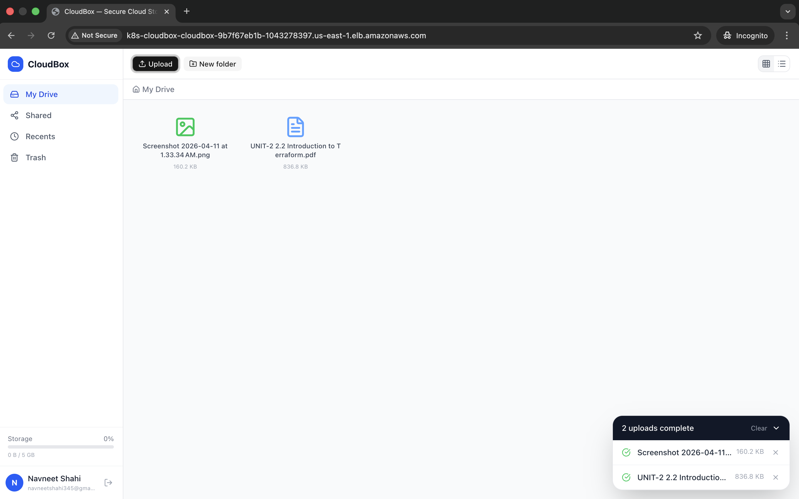
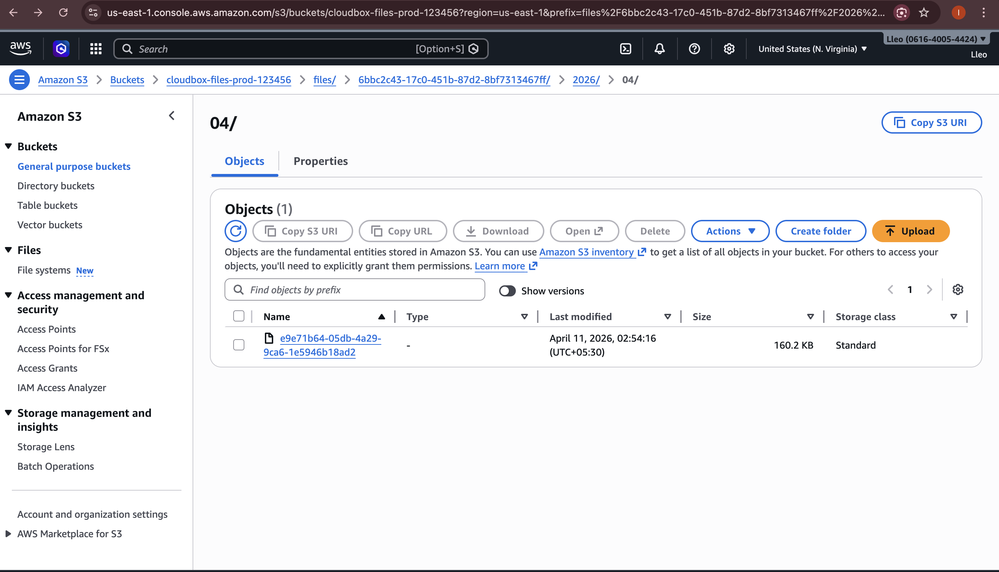
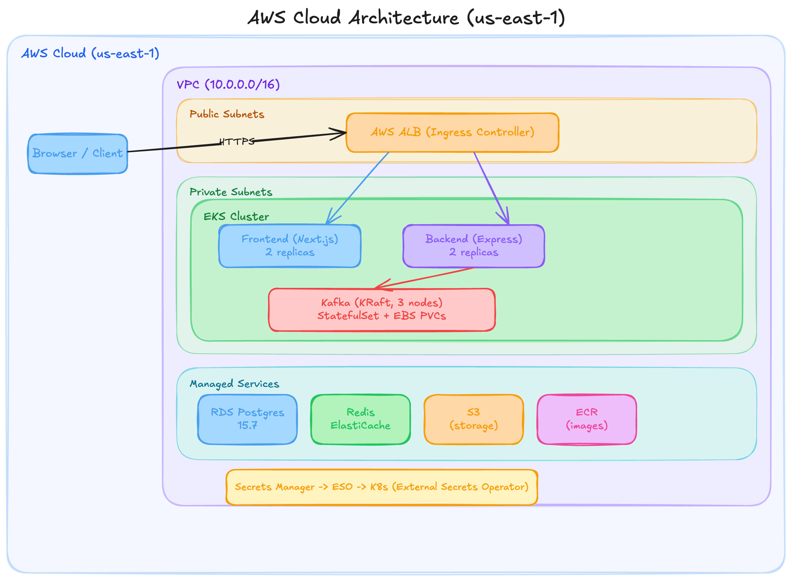

# CloudBox — Production-Grade Cloud Storage

A full-stack, production-ready Dropbox clone built from scratch and deployed on AWS EKS. Supports chunked multipart uploads to S3, real-time sync via WebSocket + Kafka, JWT authentication with refresh token rotation, and file versioning.



---

## Features

- **Chunked Uploads** — Files split into 10 MB parts, uploaded directly to S3 via presigned URLs (bypasses backend)
- **Resumable Transfers** — Lost connection? Resume from the last confirmed chunk
- **File Versioning** — Last 10 versions kept per file, one-click restore
- **Deduplication** — MD5 checksum on upload; same content reuses the existing S3 object
- **Real-time Sync** — WebSocket + Kafka fan-out; changes appear on all open sessions instantly
- **Sharing** — Public links with optional password and expiry date
- **Folder Management** — Nested folders with breadcrumb navigation
- **Security** — JWT (15 min) + rotating refresh tokens, Helmet headers, rate limiting

---

## Screenshots

| CloudBox Dashboard | S3 Storage |
|---|---|
|  |  |

---

## Architecture



**Upload flow:**
Browser → `POST /api/files/upload/init` → Backend → S3 presigned URLs
Browser → `PUT` (chunks) directly to S3 → `POST /api/files/upload/:id/complete`

---

## Tech Stack

### Application

| Layer | Technology | Notes |
|---|---|---|
| **Backend** | Node.js 20, TypeScript, Express | REST API + WebSocket |
| **ORM** | Prisma | PostgreSQL migrations |
| **Frontend** | Next.js 14, TypeScript | App Router, standalone build |
| **Styling** | Tailwind CSS | |
| **State** | Zustand + TanStack Query | Client state + server data |
| **Upload** | React Dropzone, SparkMD5 | MD5 checksum before upload |
| **Database** | PostgreSQL 15.7 | RDS, deletion protection |
| **Cache** | Redis 7 | ElastiCache, session & rate-limit |
| **Queue** | Apache Kafka 3.7.0 | KRaft mode — no ZooKeeper |
| **Object Storage** | AWS S3 | Presigned URLs, chunked multipart |
| **Auth** | JWT + refresh token rotation | 15 min access / 7 day refresh |

### Infrastructure

| Component | Technology | Notes |
|---|---|---|
| **Container Orchestration** | Kubernetes (EKS 1.29) | Managed node groups |
| **IaC** | Terraform | VPC, EKS, RDS, ElastiCache, S3, ECR, IAM |
| **Load Balancer** | AWS ALB | ALB Ingress Controller |
| **Service Mesh Auth** | IRSA | IAM roles bound to K8s service accounts |
| **Secrets** | External Secrets Operator | AWS Secrets Manager → K8s Secrets |
| **CI/CD** | GitHub Actions | Build → push to ECR → rolling deploy |
| **Container Registry** | Amazon ECR | amd64 images |
| **Monitoring** | Prometheus + Grafana | ServiceMonitor + alert rules |
| **Local Dev Storage** | MinIO | S3-compatible, Docker Compose |

---

## Repository Structure

```
cloudbox/
├── backend/
│   ├── src/
│   │   ├── modules/          auth, files, folders, shares, sync
│   │   ├── middleware/        auth, rate-limit, error-handler
│   │   ├── infrastructure/   db (Prisma), redis, kafka, s3
│   │   └── jobs/             cron housekeeping (version pruning)
│   └── prisma/               schema + migrations
│
├── frontend/
│   └── src/
│       ├── app/              pages (auth, dashboard, share)
│       ├── components/       FileCard, UploadPanel, ShareModal, ...
│       ├── hooks/            useUpload (chunked), useSync (WebSocket)
│       └── store/            authStore, uploadStore
│
├── infrastructure/
│   ├── k8s/
│   │   ├── backend/          Deployment, Service, HPA, ConfigMap, ESO
│   │   ├── frontend/         Deployment, Service, HPA
│   │   ├── kafka/            StatefulSet (3-node KRaft)
│   │   ├── ingress/          ALB Ingress
│   │   └── monitoring/       ServiceMonitor, Grafana dashboard, alerts
│   └── terraform/
│       ├── vpc.tf            VPC, subnets, NAT gateway
│       ├── eks.tf            EKS cluster + managed node group
│       ├── rds.tf            PostgreSQL 15.7
│       ├── elasticache.tf    Redis cluster
│       ├── s3.tf             Storage bucket + CORS
│       ├── ecr.tf            Container registries
│       ├── iam.tf            IRSA roles
│       ├── helm.tf           ALB controller, ESO, Prometheus stack
│       └── secrets.tf        AWS Secrets Manager entries
│
├── .github/workflows/
│   ├── ci.yml                Lint + type-check on PR
│   └── deploy.yml            Build → ECR → kubectl rollout
│
├── docker-compose.yml        Local dev (Postgres, Redis, Kafka, MinIO, Grafana)
└── Makefile                  Developer shortcuts
```

---

## Local Development

### Prerequisites

- Docker + Docker Compose
- Node.js 20
- `make`

### Quick Start

```bash
# Clone and copy env
git clone <repo>
cd cloudbox
cp .env.example .env

# Start all services
make up

# Run database migrations
make migrate

# Seed demo users
make seed
```

| Service | URL | Credentials |
|---|---|---|
| Frontend | http://localhost:3000 | — |
| Backend API | http://localhost:4000 | — |
| MinIO Console | http://localhost:9001 | `minioadmin` / `minioadmin` |
| Grafana | http://localhost:3001 | `admin` / `admin` |
| Prometheus | http://localhost:9090 | — |
| Prisma Studio | `make db-studio` | — |

Demo accounts: `alice@example.com` / `Password123!` and `bob@example.com` / `Password123!`

### Useful Make Commands

```bash
make up          # Start all services
make down        # Stop all services
make logs        # Stream backend logs
make migrate     # Run Prisma migrations
make seed        # Seed demo data
make db-studio   # Open Prisma Studio
make clean       # Remove containers + volumes (destructive)
make reset       # clean + up + migrate + seed
```

---

## Production Deployment

### 1. Provision Infrastructure (Terraform)

```bash
cd infrastructure/terraform
terraform init
terraform plan
terraform apply
```

This creates: VPC, EKS cluster, RDS (PostgreSQL 15.7), ElastiCache (Redis), S3 bucket, ECR repos, IAM roles (IRSA), and installs ALB Ingress Controller + External Secrets Operator + kube-prometheus-stack via Helm.

### 2. Build and Push Images

```bash
# amd64 required for EKS (x86) nodes — important on Apple Silicon
docker build --platform linux/amd64 -t <ECR_REPO>/backend:latest ./backend
docker build --platform linux/amd64 -t <ECR_REPO>/frontend:latest ./frontend \
  --build-arg NEXT_PUBLIC_API_URL=http://<ALB_HOST>/api \
  --build-arg NEXT_PUBLIC_WS_URL=ws://<ALB_HOST>/sync

docker push <ECR_REPO>/backend:latest
docker push <ECR_REPO>/frontend:latest
```

### 3. Deploy to Kubernetes

```bash
kubectl apply -f infrastructure/k8s/namespace.yaml
kubectl apply -f infrastructure/k8s/backend/
kubectl apply -f infrastructure/k8s/frontend/
kubectl apply -f infrastructure/k8s/kafka/
kubectl apply -f infrastructure/k8s/ingress/
```

### 4. Run Migrations

```bash
kubectl run migrate --rm -it --restart=Never \
  --image=<ECR_REPO>/backend:latest \
  -- npx prisma migrate deploy
```

### CI/CD (GitHub Actions)

On push to `main`, GitHub Actions:
1. Builds `linux/amd64` Docker images with GHA layer cache
2. Pushes to ECR
3. Runs `kubectl rollout restart` on backend and frontend deployments

---

## API Reference

### Auth
```
POST /api/auth/register
POST /api/auth/login
POST /api/auth/refresh
POST /api/auth/logout
GET  /api/auth/me
```

### Files
```
POST /api/files/upload/init                          Initiate chunked upload session
POST /api/files/upload/:sessionId/chunk              Confirm uploaded chunk (ETag)
POST /api/files/upload/:sessionId/complete           Assemble multipart upload
GET  /api/files/upload/:sessionId/status             Upload session status
GET  /api/files?folderId=&page=                      List files in folder
GET  /api/files/:fileId/download                     Get presigned download URL
DELETE /api/files/:fileId
GET  /api/files/:fileId/versions                     List file versions
POST /api/files/:fileId/versions/:versionId/restore  Restore a version
```

### Folders
```
POST   /api/folders
GET    /api/folders/:folderId
PATCH  /api/folders/:folderId
DELETE /api/folders/:folderId
```

### Shares
```
POST   /api/shares                  Create share link
GET    /api/shares/mine             List my shares
GET    /api/shares/:token/access    Access shared file (public)
DELETE /api/shares/:shareId
```

### WebSocket
```
WS /sync   Events: sync:file:uploaded, sync:file:deleted
           Heartbeat: ping/pong
```

---

## Infrastructure Highlights

### Kafka (KRaft Mode, No ZooKeeper)

3-node StatefulSet on EKS using Apache Kafka 3.7.0 in KRaft (Raft-based metadata) mode. Key configuration decisions:

- `podManagementPolicy: Parallel` — all 3 pods start simultaneously; required to form quorum
- `publishNotReadyAddresses: true` — headless DNS resolves pods before they are Ready (needed for peer discovery)
- `securityContext.fsGroup: 1000` — EBS volumes writable by Kafka's `appuser` (uid 1000)
- `KAFKA_LOG_DIRS=/var/kafka/data/logs` — log subdirectory avoids EBS `lost+found` parsing errors
- Replication factor: 3, min ISR: 2

### Secrets Management

AWS Secrets Manager stores all credentials. External Secrets Operator syncs them into Kubernetes Secrets on pod startup. No plaintext secrets in manifests or ConfigMaps.

### IRSA (IAM Roles for Service Accounts)

Backend pods carry an IAM role via IRSA, granting scoped access to S3 and Secrets Manager without static credentials.

### Upload Architecture

Client computes MD5 checksum (SparkMD5), then calls `/api/files/upload/init`. Backend creates an S3 multipart upload and returns per-chunk presigned PUT URLs. The browser uploads chunks directly to S3 (backend is not in the data path). After all chunks complete, the client calls `/complete` and the backend finalises the multipart assembly and records the file in PostgreSQL.
